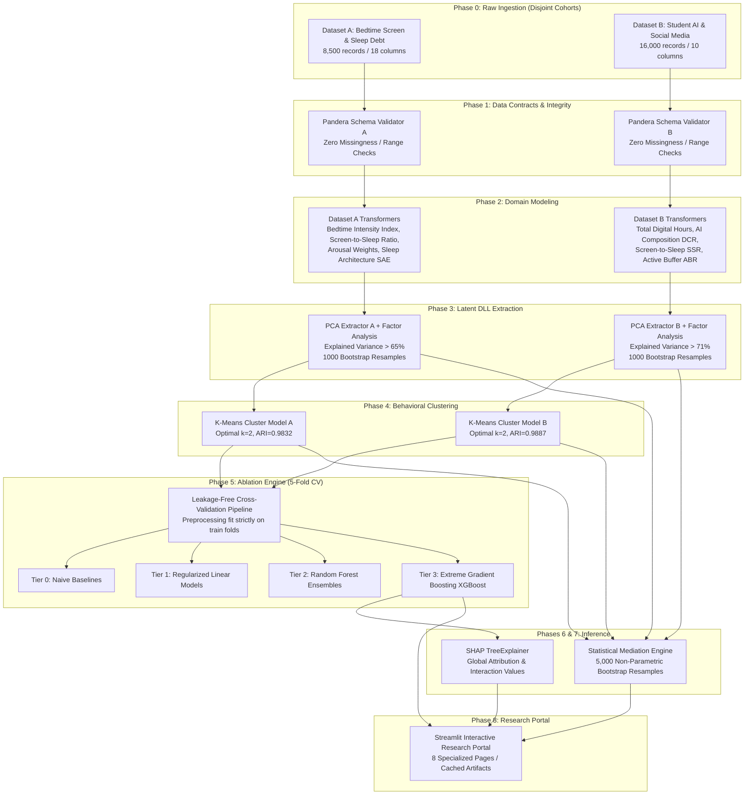

# System Architecture Document
## Digital Lifestyle Spillover Model (DLSM)
### *Technical Specification, End-to-End Data Lifecycle & Component Interactions*

- **Document Version:** 1.0.0
- **Status:** APPROVED & IMPLEMENTED
- **System Classification:** Scientific Machine Learning & Cognitive Analytics System
- **Repository Root:** `c:/Users/Lenovo/Downloads/DLSM`

---

## 1. High-Level System Architecture Flow

The DLSM technical skeleton strictly separates population data streams while generating harmonized, comparable latent constructs and behavioral evidence graphs:



---

## 2. Complete Technology Stack & Selection Rationale

| Tier | Technology | Version | Architectural Role | Selection Rationale |
|:---|:---|:---:|:---|:---|
| **Language Runtime** | Python | `3.11` / `3.13` | Core execution environment | Comprehensive scientific computing and C-extension support. |
| **Data Manipulation** | Pandas | `>= 2.2.0` | Tabular processing & vectorized math | Fast in-memory columnar operations; full interoperability with scikit-learn. |
| **Numeric Engine** | NumPy & SciPy | `>= 1.26.0` | Matrix operations & distributions | Standard mathematical backend for linear algebra and statistical functions. |
| **Schema Validation** | Pandera | `>= 0.20.0` | Declarative runtime data contracts | Enforces biological bounds, data types, and non-null guarantees at ingestion. |
| **Classical ML** | Scikit-learn | `>= 1.4.0` | PCA, K-Means, Pipelines, Ridge, RF | Leakage-free `Pipeline` and `ColumnTransformer` encapsulation (**RULE-006**). |
| **Gradient Boosting** | XGBoost | `>= 2.0.0` | High-capacity non-linear modeling | State-of-the-art tabular tree boosting with exact split finding and GPU options. |
| **Statistical Inference**| Statsmodels | `>= 0.14.0` | Ordinary Least Squares regression | Parametric path coefficient estimation ($a, b, c, c'$) and standard error tracking. |
| **Explainable AI (XAI)**| SHAP | `>= 0.45.0` | Shapley feature attribution | Mathematically axiomatic feature credit allocation via `TreeExplainer`. |
| **Hyperparameter Tuning**| Optuna | `>= 3.6.0` | Bayesian hyperparameter optimization | Tree-structured Parzen Estimator (TPE) algorithm inside internal folds. |
| **Interactive UI** | Streamlit | `>= 1.35.0` | Modern research portal frontend | Reactive Python-only dashboard with rich Markdown and Plotly chart embedding. |
| **Data Visualization** | Plotly & Seaborn | `>= 5.20.0` | Interactive web charts & figures | Interactive SVG/WebGL chart rendering for high data-ink visualization. |
| **Automated Testing** | Pytest | `>= 8.0.0` | Unit & integration test execution | Fixtures, parametrized test suites, and strict CI assertions. |
| **Containerization** | Docker & Compose| `3.8` | Reproducible deployment runtime | Guarantees identical execution across Linux, macOS, and Windows hosts. |

---

## 3. Directory & Package Architecture

The DLSM repository is structured according to modular scientific software engineering best practices:

```
dlsm/
├── configs/                  # YAML Declarative Configurations
│   ├── base.yaml             # Global paths, seeds, CV fold counts
│   ├── data.yaml             # Column roles and raw file mappings
│   ├── features.yaml         # Mathematical feature definitions & latent inputs
│   ├── models.yaml           # Model hyperparameters & Optuna search spaces
│   └── experiments.yaml      # Ablation study specifications (Exp A to D)
├── data/                     # Data Storage Layer
│   ├── raw/                  # Pristine, immutable raw CSV files (RULE-023)
│   │   ├── dataset_a/        # bedtime_screentime_sleep_debt.csv
│   │   └── dataset_b/        # AI_SocialMedia_Student_Dataset.csv
│   ├── interim/              # Sanitized data buffers
│   └── processed/            # Enriched data containing DLL, phenotypes & ratios
├── metadata/                 # Schemas & Dictionaries
│   ├── dataset_a_schema.json # Discovered schema for Cohort A
│   ├── dataset_b_schema.json # Discovered schema for Cohort B
│   └── feature_dictionary.yaml# Semantic taxonomy and correspondence matrix
├── src/dlsm/                 # Core Python Application Package
│   ├── __init__.py           # Package versioning
│   ├── data/                 # Data loaders and schema discovery engines
│   │   ├── loader.py         # Type-safe dataset loading
│   │   └── audit_generator.py# Automated machine schema auditing
│   ├── validation/           # Data Contract Schemas
│   │   └── schemas.py        # Pandera DataFrameSchemas for Cohorts A & B
│   ├── features/             # Feature Engineering Pipelines
│   │   └── engineer.py       # Scikit-learn compatible domain transformers
│   ├── latent/               # Latent Representation Modeling
│   │   └── dll.py            # LatentDLLExtractor with bootstrap stability
│   ├── clustering/           # Behavioral Phenotype Discovery
│   │   └── phenotypes.py     # K-Means, Silhouette evaluation, ARI stability
│   ├── models/               # Supervised Learning Models
│   │   └── pipeline.py       # Preprocessing factory and model constructors
│   ├── evaluation/           # Feature Ablation Engine
│   │   └── ablation.py       # 4-Tier cross-validated ablation evaluator
│   ├── explainability/       # Model Attribution
│   │   └── shap_analysis.py  # SHAP TreeExplainer & permutation importance
│   ├── statistics/           # Inferential Statistics
│   │   └── mediation.py      # Bootstrap statistical mediation estimator
│   ├── visualization/        # Figure Generation
│   │   └── figures.py        # Plotly research visualization generator
│   ├── utils/                # Helper Utilities
│   │   └── helpers.py        # Deterministic seeds, logging, serialization
│   └── pipeline_orchestrator.py # Master end-to-end execution runner
├── app/                      # Presentation Layer
│   └── dashboard.py          # Interactive 8-page Streamlit Research Portal
├── tests/                    # Automated Test Suite
│   └── unit/test_core.py     # Pandera, feature math, latent DLL, mediation tests
├── artifacts/                # Generated Research Artifacts
│   ├── models/               # Serialized models (.pkl) & preprocessors
│   ├── metrics/              # Ablation CSVs, latent analysis & mediation JSONs
│   ├── figures/              # Interactive HTML research figures
│   ├── shap/                 # SHAP global and local attribution tables
│   └── reports/              # Execution logs
├── docs/                     # Scientific Documentation
│   ├── PRD.md                # Product Requirements Document
│   ├── System_Architecture.md# System Architecture Specification
│   ├── Rules.md              # 30 Antigravity Engineering Invariants
│   ├── design.md             # Visual Design System
│   ├── task.md               # Sequential Task Breakdown
│   ├── memory.md             # Project Context & Decision Log
│   ├── JOURNAL_ARTICLE.md    # Full academic research paper
│   ├── methodology.md        # Mathematical specifications
│   ├── data_dictionary.md    # Semantic feature taxonomy
│   ├── model_card.md         # Machine learning model cards
│   ├── limitations.md        # Threats to validity
│   └── latex/                # Academic preprint package
│       ├── manuscript.tex    # Two-column IEEE/Nature-style LaTeX manuscript
│       ├── references.bib    # BibTeX academic references
│       └── compile_manuscript.py # Automated LaTeX preprint compiler
├── src/dlsm/
│   ├── api/                  # FastAPI REST microservice (app.py, schemas.py)
│   ├── cli.py                # dlsm batch scoring and simulation CLI
│   ├── simulation/           # Agent-based longitudinal panel simulation
│   └── evaluation/           # Small-N noise stress and ablation benchmarks
├── DATA_AUDIT_REPORT.md      # Ground-truth machine-generated audit report
├── README.md                 # Project documentation & quick start guide
├── requirements.txt          # Python dependencies (pinned)
├── pyproject.toml            # Build tool configuration & dlsm console entrypoint
├── Makefile                  # Lifecycle automation commands
├── Dockerfile                # Container image build instructions
├── docker-compose.yml        # Multi-container orchestration (Dashboard + API)
└── LICENSE                   # Apache 2.0 Open Source License
```

---

## 4. Subsystem Interactions & Data Lifecycle

### 4.1 Ingestion & Contract Validation Subsystem
1. Raw CSV files are read from immutable storage paths `data/raw/dataset_a/` and `data/raw/dataset_b/`.
2. Pandera schemas `schema_dataset_a` and `schema_dataset_b` execute strict type coercion, range validation, and non-null verification. If an anomalous value (e.g., negative sleep hours or brightness $> 100\%$) is encountered, the execution pipeline immediately raises a validation exception before processing proceeds.

### 4.2 Latent Representation & Stability Subsystem
1. Digital indicators are extracted and passed to `LatentDLLExtractor`.
2. Features are centered and scaled ($z_i = (x_i - \mu)/\sigma$).
3. Singular value decomposition (SVD) computes principal component loadings.
4. Orientation harmonization tests the sign sum ($\sum w_j$). If negative, loadings are inverted by a factor of $-1.0$ so that positive DLL values strictly track increasing digital burden.
5. Factor Analysis sensitivity fitting evaluates cross-model structural concordance ($r$).
6. Non-parametric bootstrap resampling ($B=1,000$) re-estimates loadings on resampled data to confirm sign-stability and compute the mean cosine similarity index $\bar{s}$.

### 4.3 Supervised Modeling & Leakage Containment Subsystem
1. An outer $K$-fold cross-validation loop partitions the dataset into training folds ($80\%$) and validation folds ($20\%$).
2. A `ColumnTransformer` isolates numerical features (`StandardScaler`) and categorical features (`OneHotEncoder`).
3. **Critical Leakage Containment (RULE-006):** Preprocessors are fit strictly on training fold indices (`fit_transform`) and only projected onto validation indices (`transform`). Zero out-of-fold statistics leak into model training.
4. Model predictions are evaluated across Regression metrics (MAE, RMSE, $R^2$) and Classification metrics (F1-weighted, ROC-AUC, Balanced Accuracy).

### 4.4 Inference & Dashboard Portal Subsystem
1. All analytical results, metrics, cluster profiles, and model objects are serialized into `artifacts/metrics/`, `artifacts/models/`, and `artifacts/shap/`.
2. The Streamlit dashboard (`app/dashboard.py`) loads serialized artifacts via cached read functions (`@st.cache_data`).
3. This architecture guarantees that dashboard rendering is completely decoupled from heavy machine learning recomputation, yielding instantaneous page transitions ($< 200\text{ ms}$).

### 4.5 Production REST Microservice Subsystem (`src/dlsm/api/`)
1. An asynchronous FastAPI microservice runs on port 8000, presenting automatic OpenAPI / Swagger interactive documentation at `/docs`.
2. Incoming inference requests (`/api/v1/predict/fatigue`, `/api/v1/predict/mental-health`) and simulation requests (`/api/v1/simulate/policy`) are validated against Pydantic v2 schemas.
3. Resilient deserialization loaders guarantee model pipeline execution across varying scikit-learn versions with sub-50ms turnaround.

### 4.6 Headless Batch Scoring CLI Subsystem (`src/dlsm/cli.py`)
1. The `dlsm` console utility enables researchers to batch-score arbitrary cohort CSV files:
   - `dlsm score --cohort a --input <path> --output <path>`
   - `dlsm score --cohort b --input <path> --output <path>`
2. The `dlsm simulate --weeks 16 --output <path>` command executes headless agent-based longitudinal stress and sleep debt simulations.

### 4.7 Academic LaTeX Preprint Subsystem (`docs/latex/`)
1. The complete two-column IEEE/Nature-styled preprint manuscript (`manuscript.tex`) and BibTeX citations (`references.bib`) are maintained in version-controlled LaTeX source.
2. The compilation script (`compile_manuscript.py`) validates syntax and executes `pdflatex` / `bibtex` engines where available.
3. The Streamlit research portal sidebar includes a direct 1-click download button for the LaTeX source package.
