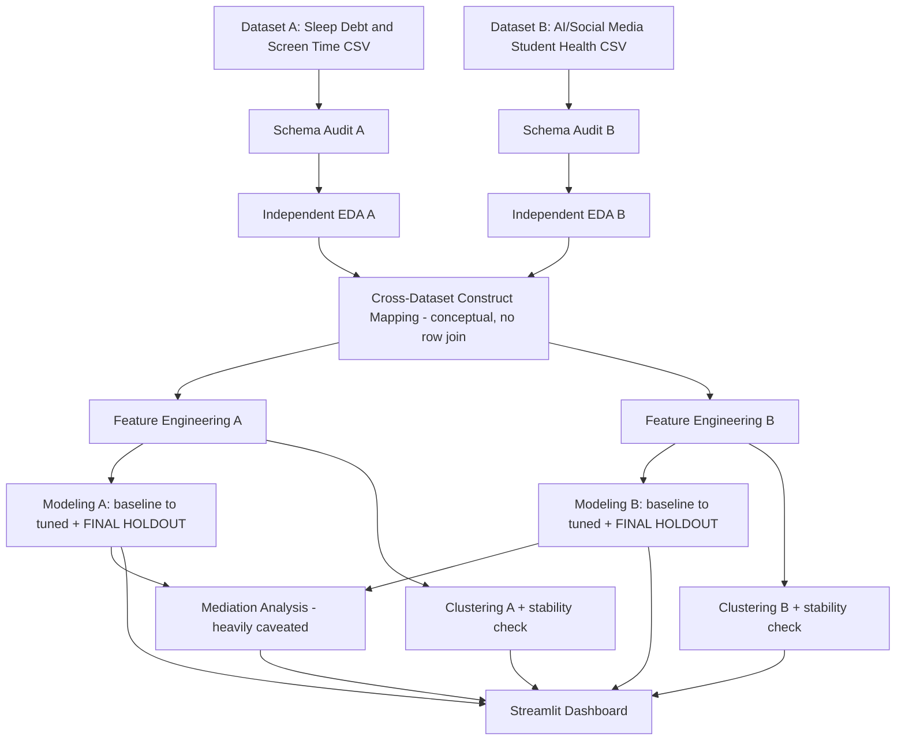

# architecture.md — System Architecture

**Version:** 1.0 — 2026-09-27
**Companion:** `PRD.md`, `rules.md`

---

## 1. High-Level Flow



**The single most important structural fact in this diagram:** there is no box anywhere that merges Dataset A and Dataset B row-for-row. They stay two separate populations feeding two separate analysis tracks that meet only conceptually, in the write-up.

## 2. Why Schema Audit Comes First, Not Feature Engineering

Both source planning documents for this project explicitly say not to invent features before seeing the real schema, then specify exact formulas (interaction terms, a melatonin-suppression calculation, named cluster archetypes) that assume columns a small self-report survey CSV likely doesn't have. This architecture makes that ordering structural, not just a stated intention: `AUDIT_A`/`AUDIT_B` block everything downstream, and nothing in `rules.md` or `task.md` skips ahead of them.

## 3. Data Handling

- **No row-level join between A and B, ever.** Any code path that attempts one is a bug, not a modeling choice — see `rules.md` RULE-004.
- **Cross-dataset "construct mapping"** means: define a construct (e.g., "nighttime digital engagement") abstractly, then check whether each dataset has a column that plausibly operationalizes it — only after the schema audit, never before.
- **Final holdout, reserved before any model selection begins**, for both datasets independently. This is not the same as a test split used during cross-validation — it is touched exactly once, after a model is otherwise chosen.
- **Clustering stability**: any cluster result is reported with its silhouette score and a bootstrap-resampled label-agreement check (e.g., Adjusted Rand Index across resamples). A clean-looking PCA/UMAP scatter plot with a weak silhouette score is not a discovered phenotype — it's what K-Means does to any blob of correlated numeric data.

## 4. Tech Stack

| Layer | Tool | Note |
|---|---|---|
| Data validation | pandera or Great Expectations | Runs immediately after the raw CSVs are loaded, before any feature is derived |
| EDA / stats | pandas, scipy, statsmodels | Spearman correlation preferred over Pearson unless normality is checked first |
| Feature engineering | pandas, scikit-learn `Pipeline`/`ColumnTransformer` | No feature is named or coded until the audit confirms the underlying columns exist |
| Latent variable | scikit-learn PCA / factor_analyzer | Reported with explained variance and loadings, not just "DLL score" as a black box |
| Clustering | scikit-learn KMeans/GaussianMixture, hdbscan | Always paired with the stability check in §3 |
| Modeling | scikit-learn (baseline, logistic, RF), xgboost/lightgbm (optional, only if they beat simpler models on the true holdout) | |
| Explainability | SHAP (TreeExplainer) | Only computed on models that clear the final-holdout bar — no SHAP plots for a model that didn't actually validate |
| Dashboard | Streamlit | Simplicity and fast iteration outweigh Dash/Gradio's extra flexibility for this scope |
| Tracking | A single `experiments.csv` log (run name, params, CV score, **holdout score**, timestamp) | MLflow/W&B are legitimate but optional — don't let tracking infrastructure outweigh the two datasets' actual size |

## 5. Repository Structure

```
dlsm/
├── data/{raw,interim,processed}/
├── notebooks/{01-audit-a, 02-audit-b, 03-eda-a, 04-eda-b, 05-construct-mapping}.ipynb
├── src/
│   ├── data/          audit.py, validate.py
│   ├── features/       construct_mapping.py, engineer.py
│   ├── models/         baseline.py, tuned.py, holdout_eval.py
│   ├── clustering/      phenotype.py, stability.py
│   └── mediation/       pathway.py
├── app/dashboard.py
├── configs/{data.yaml, features.yaml, model.yaml}
├── tests/
├── docs/ (this file + PRD/rules/design/task/memory)
└── requirements.txt
```

## 6. MLOps — Kept Proportionate

DVC, full MLflow tracking servers, and Dockerized deployment are legitimate tools, but disproportionate for two CSVs under 300KB combined. Default to a lightweight `experiments.csv` log and a plain `requirements.txt` (§ above); revisit heavier tooling only if the project scope genuinely grows (e.g., if real longitudinal data replaces the Kaggle snapshots later).
